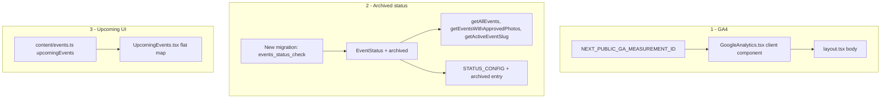

# Plan: GA4, archived events, unified upcoming cards

## Key findings from upstream comparison

- **GA4**: Upstream mounts `<GoogleAnalytics />` in layout after `ChunkLoadErrorHandler`, before `{children}`. Fork already has `NEXT_PUBLIC_GA_MEASUREMENT_ID` in `[.env.local.example](.env.local.example)`.
- **Archived queries**: Upstream adds `.neq("status", "archived")` to exactly **two** functions: `getAllEvents` and `getEventsWithApprovedPhotos`. It does **not** filter `getActiveEventSlug`, `getSeriesEvents`, or `getSeriesAttendanceData`. The original plan's suggestion to also filter `getActiveEventSlug` is a sensible fork-specific hardening (prevents the fallback query from selecting an archived row as the site-wide active event).
- **Upcoming UI**: Upstream removes the featured/compact split entirely. Uses a flat `upcomingEvents.map()` with `space-y-4` where every event gets an identical full card (radial overlay, pulsing dot, date, city, title, register CTA). The `formatDate` helper simplifies to one style (always `month: 'long'`).

---

## 1. Google Analytics (GA4)

**New file**: `[src/components/analytics/GoogleAnalytics.tsx](src/components/analytics/GoogleAnalytics.tsx)`

Exact upstream-verified implementation:

```tsx
"use client";

import Script from "next/script";

const GA_MEASUREMENT_ID = process.env.NEXT_PUBLIC_GA_MEASUREMENT_ID;

export function GoogleAnalytics() {
  if (!GA_MEASUREMENT_ID) return null;

  return (
    <>
      <Script
        src={`https://www.googletagmanager.com/gtag/js?id=${GA_MEASUREMENT_ID}`}
        strategy="afterInteractive"
      />
      <Script id="ga4-init" strategy="afterInteractive">
        {`
          window.dataLayer = window.dataLayer || [];
          function gtag(){dataLayer.push(arguments);}
          gtag('js', new Date());
          gtag('config', '${GA_MEASUREMENT_ID}');
        `}
      </Script>
    </>
  );
}
```

**Edit**: `[src/app/layout.tsx](src/app/layout.tsx)`

- Add import: `import { GoogleAnalytics } from "@/components/analytics/GoogleAnalytics";`
- Mount `<GoogleAnalytics />` inside `<body>` after `<ChunkLoadErrorHandler />`, before `{children}` (matches upstream placement).

No new dependencies. No build-config changes.

---

## 2. `archived` event status

### 2a. Database migration

**New file**: `supabase/migrations/20260415_add_archived_event_status.sql`

Naming follows the `YYYYMMDD_description.sql` convention established by `20260326_shanghai_rebrand.sql` (the latest dated migration).

```sql
-- Add "archived" to the events.status CHECK constraint
ALTER TABLE events DROP CONSTRAINT IF EXISTS events_status_check;
ALTER TABLE events ADD CONSTRAINT events_status_check
  CHECK (status IN ('draft', 'published', 'active', 'completed', 'archived'));
```

Per AGENTS.md: do **not** edit historical migration files. The upstream migration also ran Calgary-specific `UPDATE` statements to archive old rows -- omit those entirely. Archive Shanghai events later via Supabase dashboard/SQL by slug or id when needed.

### 2b. Types

**Edit**: `[src/types/index.ts](src/types/index.ts)` line 4

```
- export type EventStatus = "draft" | "published" | "active" | "completed";
+ export type EventStatus = "draft" | "published" | "active" | "completed" | "archived";
```

### 2c. Queries

**Edit**: `[src/lib/supabase/queries.ts](src/lib/supabase/queries.ts)`

Three functions need `.neq("status", "archived")`. Two match upstream; one is a fork-specific hardening.


| Function                              | Line (approx)               | Upstream does it?         | Rationale                                                                    |
| ------------------------------------- | --------------------------- | ------------------------- | ---------------------------------------------------------------------------- |
| `getAllEvents`                        | after `.select(...)`        | Yes                       | Admin venue selector and event list should not offer archived events         |
| `getEventsWithApprovedPhotos`         | after `.in("id", eventIds)` | Yes                       | Recap/hero data should not surface archived event photos                     |
| `getActiveEventSlug` (fallback query) | after `.select("slug")`     | **No** (fork enhancement) | Prevents fallback from picking an archived row as the site-wide active event |


`**getAllEvents`** (~line 176):

```diff
  .select("id, slug, name, venue, start_time, status, admin_code")
+ .neq("status", "archived")
  .order("start_time", { ascending: false });
```

`**getEventsWithApprovedPhotos**` (~line 1749):

```diff
  .in("id", eventIds)
+ .neq("status", "archived")
  .order("start_time", { ascending: false });
```

`**getActiveEventSlug**` fallback (~line 148):

```diff
  .select("slug")
+ .neq("status", "archived")
  .order("start_time", { ascending: false })
```

**Optional (same PR or follow-up)**: `getSeriesEvents` and `getSeriesAttendanceData` -- upstream does not filter these. Add `.neq("status", "archived")` only if you want archived series children to disappear from analytics UIs. Recommend deferring.

### 2d. Admin UI

**Edit**: `[src/app/admin/[adminCode]/events/page.tsx](src/app/admin/[adminCode]/events/page.tsx)` `STATUS_CONFIG` (~line 17):

```diff
  completed: { label: "Completed", color: "text-gray-600" },
+ archived:  { label: "Archived",  color: "text-gray-700" },
```

This matches upstream exactly. Without it, archived events fall through to `draft` styling via the `?? STATUS_CONFIG.draft` fallback.

### 2e. Mock mode

`[src/lib/mock/data.ts](src/lib/mock/data.ts)` `MOCK_EVENT` uses `status: "active"` which remains a valid `EventStatus`. **No change needed.** The mock query layer (`src/lib/mock/queries.ts`, swapped in via webpack alias) returns in-memory arrays and does not call `.neq()` on Supabase, so mock mode is unaffected.

---

## 3. Landing: unified upcoming event cards

**Edit**: `[src/components/landing/UpcomingEvents.tsx](src/components/landing/UpcomingEvents.tsx)`

Replace the featured-card + compact-list split with a flat map producing identical cards. Key structural changes:

- **Remove**: `const [featured, ...rest] = upcomingEvents;` and the separate featured card `<motion.div>` and the `rest.length > 0 && (...)` compact list block.
- **Remove**: The two-style `formatDate(date, style)` helper. Replace with single-style `formatDate(date)` using `month: 'long'` always (upstream pattern).
- **Remove**: The `city` variable derived from `featured.location`.
- **Add**: `<div className="space-y-4">` wrapping `upcomingEvents.map(...)`.
- **Each card**: Reuses the featured card's markup (radial gradient overlay, pulsing dot, date line, city, title, register CTA) but uses `event.displayDate ?? formatDate(event.date)` for the date (upstream pattern, leveraging `CursorEvent.displayDate` for multi-day strings like "March 14-15, 2026").

The upstream structure (reconstructed from raw fetch + context):

```tsx
<div className="space-y-4">
  {upcomingEvents.map((event, index) => {
    const eventCity = event.location.split(',')[0].trim();
    return (
      <motion.div
        key={event.id}
        initial={{ opacity: 0, y: 10 }}
        whileInView={{ opacity: 1, y: 0 }}
        viewport={{ once: true, margin: '-50px' }}
        transition={{ duration: 0.4, delay: index * 0.08 }}
        className="relative overflow-hidden bg-cursor-surface border border-cursor-border border-l-2 border-l-cursor-accent-blue rounded-lg p-5"
      >
        <div className="pointer-events-none absolute -inset-px rounded-lg bg-[radial-gradient(ellipse_at_bottom_left,rgba(168,180,200,0.06),transparent_60%)]" />
        <div className="flex items-center gap-2 text-sm text-cursor-text-muted mb-2">
          <span className="relative flex h-2.5 w-2.5">
            <span className="animate-ping absolute inline-flex h-full w-full rounded-full bg-cursor-accent-blue opacity-75" />
            <span className="relative inline-flex rounded-full h-2.5 w-2.5 bg-cursor-accent-blue" />
          </span>
          <span>{event.displayDate ?? formatDate(event.date)}</span>
          <span className="text-cursor-text-faint">&middot;</span>
          <span>{eventCity}</span>
        </div>
        <h3 className="text-2xl font-bold text-cursor-text mb-3">{event.title}</h3>
        {event.lumaUrl ? (
          <a href={event.lumaUrl} target="_blank" rel="noopener noreferrer"
            className="inline-flex items-center gap-2 bg-cursor-text text-cursor-bg rounded-md px-5 py-2.5 text-sm font-medium hover:opacity-90 transition-opacity"
          >
            {t('home.register')}
            <ExternalLink className="w-3.5 h-3.5" />
          </a>
        ) : null}
      </motion.div>
    );
  })}
</div>
```

No changes to `[src/content/events.ts](src/content/events.ts)` or `[src/lib/landing-types.ts](src/lib/landing-types.ts)`.

---

## Verification checklist

- `npm run build` -- GA component is client-only; layout stays a server component; no new deps.
- With `NEXT_PUBLIC_GA_MEASUREMENT_ID` empty: page loads, no gtag scripts injected (component returns `null`).
- After migration applied to Supabase: confirm `INSERT INTO events (..., status) VALUES (..., 'archived')` succeeds and `getAllEvents` result no longer includes that row.
- Admin events list: archived events show "Archived" chip in `text-gray-700`.
- Landing `#upcoming` section: with 1 upcoming event, shows one full card; with N upcoming events, shows N identical-style cards with `space-y-4` gap.
- Mock mode (`NEXT_PUBLIC_USE_MOCK_DATA=true`): landing and admin pages render without errors.




