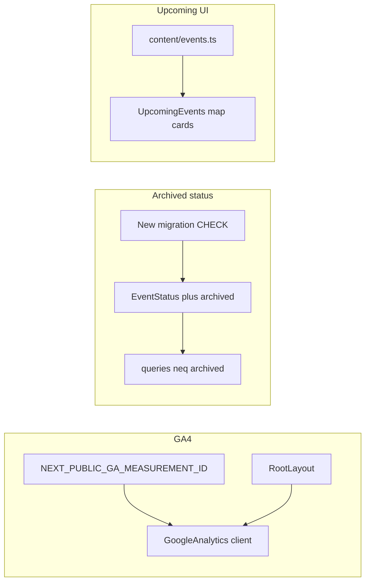

# Plan: GA4, archived events, unified upcoming cards

## Scope recap

| # | Feature | Upstream reference | Your codebase touchpoints |
|---|---------|-------------------|---------------------------|
| 1 | **GA4** | [`GoogleAnalytics.tsx`](https://github.com/cursorcommunityled/Cursor-Event-Portal/blob/main/src/components/analytics/GoogleAnalytics.tsx) pattern | New component + [`src/app/layout.tsx`](src/app/layout.tsx); env already in [`.env.local.example`](.env.local.example) |
| 2 | **`archived` event status** | Migration alters `events.status` CHECK; queries use `.neq("status", "archived")` for lists | **New** migration (do not edit old migrations per [AGENTS.md](AGENTS.md)); [`src/types/index.ts`](src/types/index.ts); [`src/lib/supabase/queries.ts`](src/lib/supabase/queries.ts); [`src/app/admin/[adminCode]/events/page.tsx`](src/app/admin/[adminCode]/events/page.tsx) |
| 3 | **Upcoming events UI** | One full card per row in [`UpcomingEvents.tsx`](https://github.com/cursorcommunityled/Cursor-Event-Portal/blob/main/src/components/landing/UpcomingEvents.tsx) | [`src/components/landing/UpcomingEvents.tsx`](src/components/landing/UpcomingEvents.tsx) |

**Note:** Upstream’s migration also ran `UPDATE events SET status = 'archived' WHERE start_time::date IN (...)` for **Calgary-specific dates**. For Shanghai you should **not** copy those dates blindly: add the constraint in migration, then archive via Supabase SQL/dashboard by **slug or id** when needed, or add a separate one-off SQL note in the PR for your prod data.

---

## 1. Google Analytics (GA4)

**Implementation**

- Add [`src/components/analytics/GoogleAnalytics.tsx`](src/components/analytics/GoogleAnalytics.tsx) as a **client** component mirroring upstream: `next/script` with `strategy="afterInteractive"`, read `process.env.NEXT_PUBLIC_GA_MEASUREMENT_ID`, return `null` if unset (safe for local/mock).
- In [`src/app/layout.tsx`](src/app/layout.tsx), render `<GoogleAnalytics />` once inside `<body>` (e.g. after `ChunkLoadErrorHandler`, before `{children}`).

**Ops**

- Set `NEXT_PUBLIC_GA_MEASUREMENT_ID` in Render (and local `.env.local`) to your GA4 Measurement ID (`G-…`).
- No new dependencies.

---

## 2. `archived` status on Supabase `events`

**Database**

- Add a **new** migration under [`supabase/migrations/`](supabase/migrations/) (timestamped name, e.g. `20260415_add_archived_event_status.sql`) that:
  - `ALTER TABLE events DROP CONSTRAINT IF EXISTS events_status_check;`
  - `ALTER TABLE events ADD CONSTRAINT events_status_check CHECK (status IN ('draft', 'published', 'active', 'completed', 'archived'));`
  - **Omit** Calgary-specific `UPDATE` unless you intentionally want to archive rows in your DB by those dates.

- Optionally refresh [`supabase/schema.sql`](supabase/schema.sql) if your workflow keeps it in sync with migrations (many teams regenerate from DB after apply).

**Types**

- Extend `EventStatus` in [`src/types/index.ts`](src/types/index.ts) with `"archived"`.

**Queries (list / public surfaces)**

Match upstream behavior: **exclude** archived from **lists**, but keep [`getEventBySlug`](src/lib/supabase/queries.ts) unchanged so direct links still resolve (same as upstream).

Apply `.neq("status", "archived")` where upstream does:

- [`getAllEvents`](src/lib/supabase/queries.ts) — admin venue selector must not offer archived events.
- [`getEventsWithApprovedPhotos`](src/lib/supabase/queries.ts) — recap/hero data should not surface photos for archived events unless you explicitly want that (upstream excludes).
- [`getActiveEventSlug`](src/lib/supabase/queries.ts) — fallback query that `order("start_time").limit(1)` should **not** pick an archived row; add `.neq("status", "archived")`.

**Optional consistency (same PR or follow-up)**

- [`getSeriesEvents`](src/lib/supabase/queries.ts) / [`getSeriesAttendanceData`](src/lib/supabase/queries.ts): add `.neq("status", "archived")` if archived series children should disappear from analytics UIs.

**Admin UI**

- In [`src/app/admin/[adminCode]/events/page.tsx`](src/app/admin/[adminCode]/events/page.tsx), extend `STATUS_CONFIG` with `archived: { label: "Archived", color: "..." }` so status chips don’t fall through to `draft`.

**Mock mode**

- If mock [`Event`](src/types/index.ts) objects in [`src/lib/mock/data.ts`](src/lib/mock/data.ts) are typed with `EventStatus`, ensure they still use a valid status (no code change if already `active` / etc.).

---

## 3. Landing: consistent upcoming event cards

**Implementation**

- Refactor [`src/components/landing/UpcomingEvents.tsx`](src/components/landing/UpcomingEvents.tsx) to match upstream structure:
  - Remove “featured + compact list” split.
  - `upcomingEvents.map(...)` with **`space-y-4`**.
  - Reuse the **same** card markup (radial overlay, pulsing dot, date line, title, register button) for **every** event.
 - Use `event.displayDate ?? formatDate(event.date)` for the date line (upstream pattern) so multi-day strings in content still display cleanly.

**Static content**

- No change required in [`src/content/events.ts`](src/content/events.ts) for this UI task unless you want extra upcoming rows to validate the new layout.

---

## Verification

- `npm run build` — GA component is client-only; layout stays a server component.
- With `NEXT_PUBLIC_GA_MEASUREMENT_ID` empty: page loads, no scripts (component returns `null`).
- After migration: apply to Supabase (staging first); confirm inserts/updates accept `archived` and admin list hides archived events from `getAllEvents`.
- Visually: landing `#upcoming` shows N identical-style cards when multiple upcoming entries exist.

